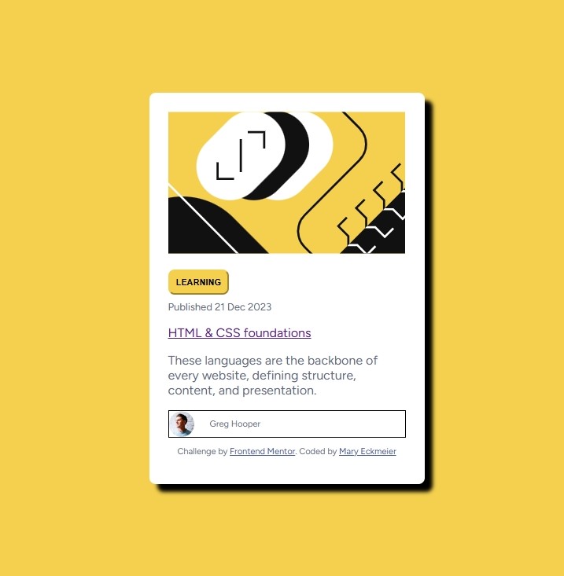

# Frontend Mentor - Blog preview card solution

This is a solution to the [Blog preview card challenge on Frontend Mentor](https://www.frontendmentor.io/challenges/blog-preview-card-ckPaj01IcS). Frontend Mentor challenges help you improve your coding skills by building realistic projects. 

## Table of contents

- [Overview](#overview)
  - [The challenge](#the-challenge)
  - [Screenshot](#screenshot)
  - [Links](#links)
- [My process](#my-process)
  - [Built with](#built-with)
  - [What I learned](#what-i-learned)
  - [Continued development](#continued-development)
  - [Useful resources](#useful-resources)
- [Author](#author)
- [Acknowledgments](#acknowledgments)


## Overview


### The challenge

Users should be able to:

- See hover and focus states for all interactive elements on the page

### Screenshot




### Links

- Solution URL: ([https://github.meckmeier.blog-preview-card-main.com](https://github.com/meckmeier/blog-preview-card-main))
- Live Site URL: ([https://meckmeier.github.io.com\blog-preview-card-main](https://meckmeier.github.io/blog-preview-card-main))

## My process

### Built with

- Semantic HTML5 markup
- CSS custom properties
- Flexbox
- CSS Grid
- Mobile-first workflow

### What I learned

I learned about centering objects on the page. Using custom colors, and ordering my workflow to build the HTML first, and add in the css after. It was a back and forth for me - but the process is becoming more clear now. I 
I am trying to use more semantic classes (saying what stuff IS rather than how it LOOKS) is tricky but it feels like it will work better when you have a larger site. As I try to lay things out though I have to add more categories, so it's been a bit of an iterative process.

```css
    main {
      display: flex;
      justify-content: center;
      align-items: center;
      height: 100vh;
    }
Trying to figure out how to center the card on the page was really difficult to me. Until I added the height: 100vh (offered by emmet in my vs environment) I could not get the vertical alignment to work. I'd love to know why that is, but for now - it works.


### Continued development

I think being able to practice this basic stuff is really key to getting better at it. I am still looking up a lot of coding as I go, but the more I do, it the less I have to look up. 

### Useful resources

- [Centering Vertically](https://www.bing.com/videos/riverview/relatedvideo?q=i+want+to+center+vertically+the+entire+grid+itself+on+a+page+in+css&mid=78C6800F16D425DE965778C6800F16D425DE9657&FORM=VIRE) - This helped me -acknowleding Kevin Powell - the CSS guru!

- [Using GridBox](https://courses.wesbos.com/account) - also this free course from Wes Bos to learn more about grid.

- [Many lookups]
https://www.w3schools.com

## Author

- Website - Mary Eckmeier 
- Frontend Mentor - [@meckmeier](https://www.frontendmentor.io/profile/meckmeier)

## Acknowledgments

Kevin Powell, W3Schools and Wes Bos - thanks!
